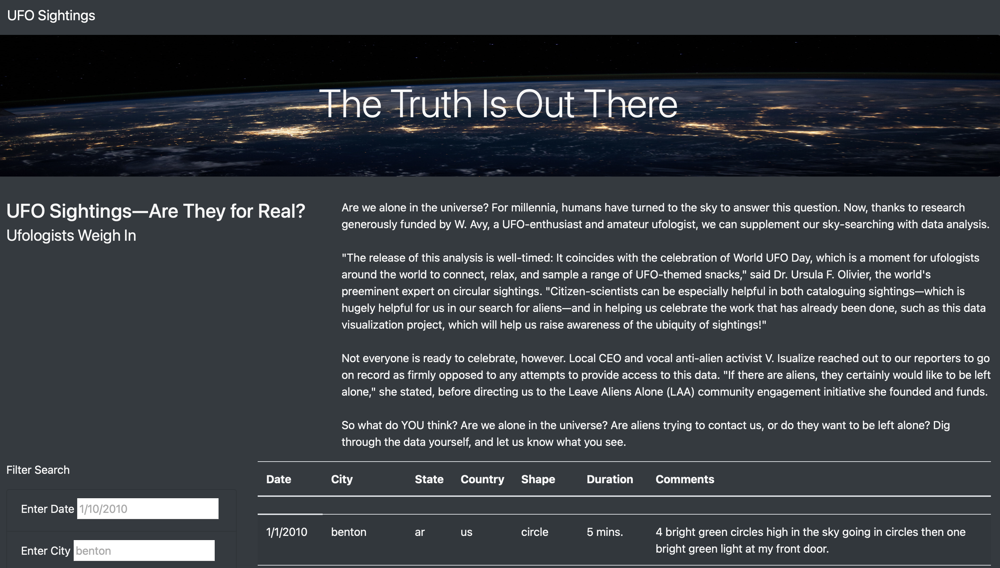
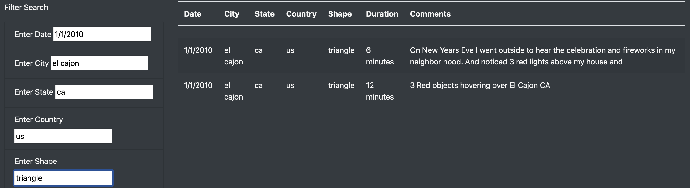

# UFO Sightings 

## **Overview of Project**

The objective of the project was to create a website that displays a dynamic table with UFOs sightings in different parts of the United States and Canada. The page contains a form to input and filter data.

The website was created using HTML for the basic structure and Bootstrap to control the look of the site. There is also a style.css file that works in combination with Bootstrap to complete the decoration and feel of the website.

The website shows a table with the data of the sightings, including datetime, city, state, country, shape, duration Minutes and comments. 

## Results

Below is a screenshot of the webpage: 

The page is clean, and organized in a user-friendly way, that allows filtering the data of the UFO sightings based on: 

- Date
- City
- State
- Country
- Shape 

By clicking 'enter' after entering the specific filters needed, the user can get more specific data, for example:

- the date: 1/1/2010
- the city: el cajon
- the state: ca
- the country: us
- the shape: triangle

Once this search is done it will generate the following results:

## Summary

In this project, we created a page that aesthetically displays our data while also doing so in a user-friendly way through easy and simple filters. 

One of the drawbakes of this project could be filters to browse the data is not enough, such as a filter to select from different shapes or if there are specific locations that have more than one sighting. 

In order to improve this webpage, there needs to be more data that provides more detail to each event so that it's more information to be displayed and to better organize the results in a more meaningful way than just displaying individual events. In addition to that, an option to upload media, like images, can lead to the creation of a very reliable database for UFO sightings.

